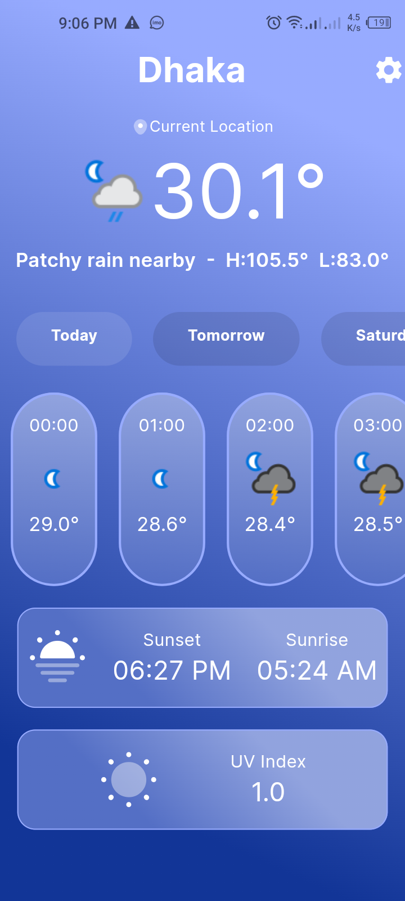
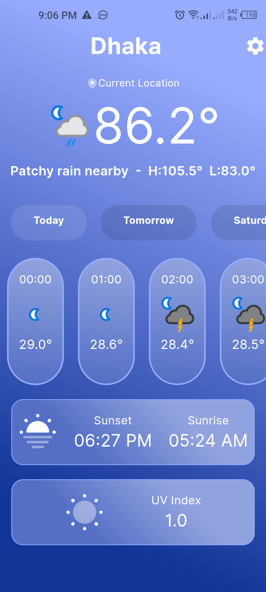
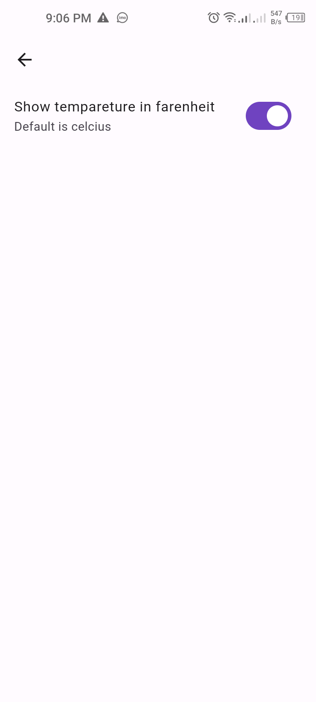

# Weater App

## Description
Welcome to the Weather App, your go-to solution for staying updated on weather conditions effortlessly.

## Key Features
- **State Management Provider:** Utilizing the power of Bloc architecture ensures a robust and scalable application structure, enhancing code organization and maintainability.

- **Clean Code with Detailed Comments:** Our codebase boasts clean and well-organized code, complemented by detailed comments for enhanced readability and maintainability, streamlining the development process.

- **Real-Time Weather Updates:** Stay informed with real-time weather updates, providing accurate and timely information for your location.
-
- **User-Friendly Interface:**  Enjoy a sleek and intuitive user interface designed for seamless navigation and enhanced user experience.
-
- **Location-Based Forecast:** Get weather forecasts tailored to your location, ensuring you're prepared for whatever the elements may bring.

## Screenshots

|                                 Weather Screen (c)               |         Weather Screen (F)                                  |                   Seattings Screen                                  |                                |
|:--------------------------------------------------------------:|:--------------------------------------------------------------:|:--------------------------------------------------------------:|:--------------------------------------------------------------:|
|  |  |  |

## Download APK
1. Download Link : `https://drive.google.com/file/d/13jSfxTOOEKiPriSJ5MQqbuhQLxjpvhCi/view?usp=drive_link`

## Installation
1. Clone the repository: `git clone https://github.com/Margub-Morshed/Job-Board-App.git`
2. Install dependencies: `flutter pub get`
3. Run the app: `flutter run`

## Contributing
